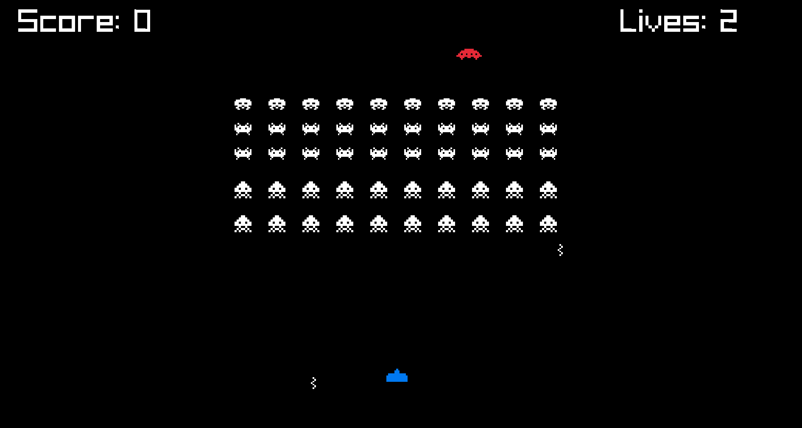

# Space-Invaders

Re-creation of Space Invaders game, built using  using C++ and the [raylib](https://github.com/raysan5/raylib) library.



# How to run

## Build Raylib

```bash
cd raylib
mkdir build && cd build
cmake ..
make
sudo make install
sudo ldconfig
```

## Build Game

```bash
cd src
cmake -S . -B build
cmake --build build
```
## Credits

The textures used for this game were taken from [brunotnasc](https://github.com/brunotnasc/space-invaders)


